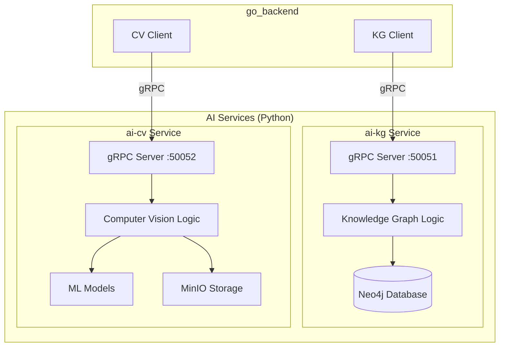
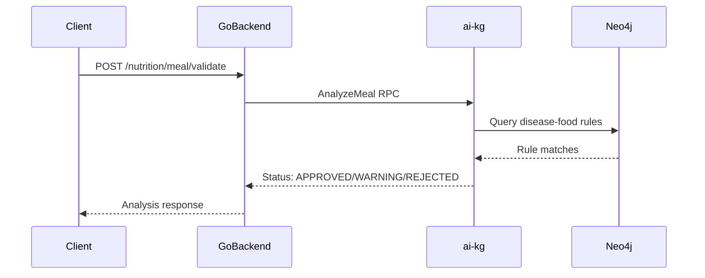
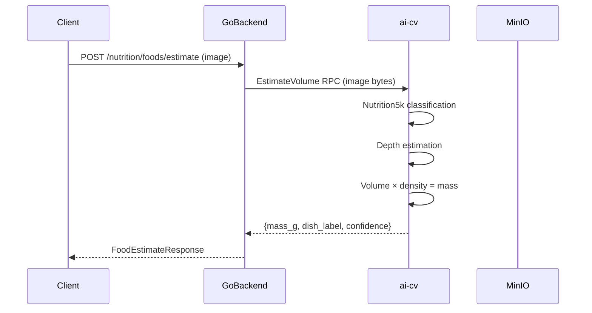
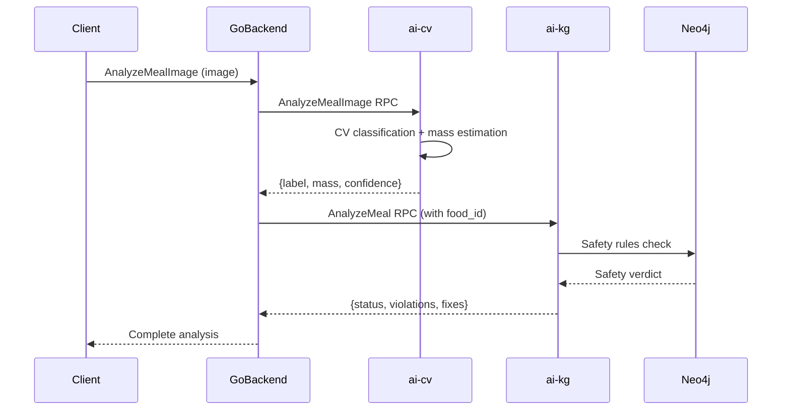

# NutriX — AI & Intelligence Documentation

> **Document Type**: AI/ML/LLM Technical Documentation
> **Version**: 1.0
> **Last Updated**: 2026-08-25
> **Evidence**: `internal/infrastructure/grpc_nutrition_client.go`, `internal/domain/nutrition_intelligence_port.go`, `docker-compose.prod.yml`

---

## AI Architecture Overview

NutriX uses two AI services via gRPC:



---

## AI Services

### 1. Knowledge Graph Service (ai-kg)

**Technology Stack**:
- Python (async)
- gRPC (port 50051)
- Neo4j (graph database)
- PostgreSQL (AI services DB)
- LLM for enrichment (Gemini/OpenAI, configurable)

**Purpose**: Food safety analysis, disease rules, recommendations

**Evidence**: `docker-compose.prod.yml:111-145`, `internal/infrastructure/grpc_nutrition_client.go`

#### RPC Methods

| RPC | Purpose | Status |
|---|---|---|
| `HealthCheck` | Connectivity + Neo4j check | ✅ Implemented |
| `AnalyzeFood` | Single food safety analysis | ✅ Implemented |
| `BatchAnalyzeFoods` | Multiple foods at once | ⚠️ Stub (returns error) |
| `GetRecommendations` | Nutrient gap recommendations | ✅ Implemented |
| `AnalyzeMeal` | Composite meal safety validation | ✅ Implemented |
| `GetThresholdSnapshot` | Disease-specific nutrient thresholds | ✅ Implemented |
| `SubmitFoodCorrection` | User correction feedback | ✅ Implemented |
| `SubmitFoodAcceptance` | User acceptance feedback | ✅ Implemented |
| `SubmitFoodViewed` | User viewed feedback | ✅ Implemented |
| `ExplainFood` | KG reasoning explanation | ⚠️ Stub (returns error) |
| `GetFeedbackAnalytics` | Feedback analytics | ⚠️ Stub (not called) |
| `GetNutritionGap` | Calculate nutrient gaps | ⚠️ Stub (not called) |

#### Knowledge Graph Model

**Node Types**:
- Food
- Disease
- Nutrient
- Symptom
- Ingredient

**Relationship Types**:
- Food → [CONTAINS_NUTRIENT] → Nutrient
- Food → [MAY_TRIGGER] → Disease
- Disease → [AFFECTS] → Nutrient
- Food → [IS_SAFE_FOR] → Disease
- Food → [IS_UNSAFE_FOR] → Disease

**Evidence**: Architecture assumes this model, actual schema in AI_server repo

### 2. Computer Vision Service (ai-cv)

**Technology Stack**:
- Python
- gRPC (port 50052)
- HTTP API (port 8081)
- ML Models (Nutrition5k, Depth-Anything)
- MinIO (object storage)

**Purpose**: Food recognition, volume/mass estimation

**Evidence**: `docker-compose.prod.yml:147-201`, `internal/infrastructure/grpc_ai_client.go`

#### RPC Methods

| RPC | Purpose | Status |
|---|---|---|
| `EstimateVolume` | Volume estimation from image | ✅ Implemented |
| `CreateUploadSession` | Get presigned URL for S3 | ⚠️ Not integrated |
| `ConfirmUpload` | Confirm S3 upload complete | ⚠️ Not integrated |
| `AnalyzeMealImage` | End-to-end: Image → CV → KG → Recommendation | ✅ Implemented |

#### ML Models

| Model | Purpose | Evidence |
|---|---|---|
| Nutrition5k | Food dish classification | Config: `NUTRIX_DIRECT_MASS_MODE` |
| Depth-Anything | Depth estimation for volume | Config: depth_anything_v2_relative weights |

**Current Configuration**:
```yaml
NUTRIX_DIRECT_MASS_MODE: primary  # Use Nutrition5k + depth
NUTRIX_MODEL_DEVICE: cpu  # CPU fallback (GPU requires NVIDIA)
```

---

## AI Model Providers

### LLM Integration (ai-kg)

| Provider | Config Variable | Status |
|---|---|---|
| Gemini | `GEMINI_API_KEY` | ✅ Configurable |
| OpenAI | `OPENAI_API_KEY` + `OPENAI_MODEL` | ✅ Configurable |

**Default**: Gemini (`GEMINI_API_KEY`)

**Used For**:
- Food enrichment (when `NUTRIX_ENABLE_MEAL_ENRICHMENT=true`)
- Reasoning chains
- Natural language explanations

**Evidence**: `docker-compose.prod.yml:126-130`

### CV Model

| Model | Type | Source |
|---|---|---|
| Nutrition5k | Classification | Bundled weights |
| Depth-Anything v2 | Depth Estimation | Bundled weights |

---

## Inference Flow

### Food Safety Analysis



### Volume Estimation (CV)



### End-to-End Pipeline



---

## Prompt Engineering

### Food Enrichment Prompts (ai-kg)

**Trigger**: `NUTRIX_ENABLE_MEAL_ENRICHMENT=true`

**Provider Selection**: `NUTRIX_ENRICHMENT_LLM_PROVIDER` (gemini or openai)

**Purpose**: Generate detailed food metadata (ingredients, cooking method, etc.)

**Evidence**: `docker-compose.prod.yml:124-127`

### Safety Analysis Prompts

**Process**: Implicit in Neo4j Cypher queries and rule engine
- No LLM calls for basic safety checks
- LLM used for enrichment only (optional feature)

---

## Tools & Agents

### ai-kg Tools

| Tool | Type | Purpose |
|---|---|---|
| Neo4j Driver | Database | Graph traversal, rule evaluation |
| LLM Client | AI | Food enrichment, explanations |
| PostgreSQL Client | Database | AI services data storage |

**Agent Capabilities**:
- Rule-based reasoning (Neo4j)
- LLM-based enrichment (optional)
- Recommendation generation

### ai-cv Tools

| Tool | Type | Purpose |
|---|---|---|
| Nutrition5k Model | ML | Dish classification |
| Depth-Anything | ML | Depth estimation |
| MinIO Client | Storage | Image retrieval |

---

## Evaluation

### KG Accuracy

- **Validation**: User feedback loop (`SubmitFoodCorrection`, `SubmitFoodAcceptance`)
- **Feedback Storage**: AI services PostgreSQL (`food_corrections` table)
- **Analytics**: `GetFeedbackAnalytics` RPC (stub)

**Evidence**: `internal/infrastructure/grpc_nutrition_client.go:296-354`

### CV Accuracy

- **Metrics**: Confidence scores on classification
- **Mass Estimation**: Based on depth + density assumptions
- **Validation**: Not implemented in backend

**Note**: Production accuracy metrics not available in current codebase

---

## Guardrails

### Safety Gates

1. **Profile Validation** (Go backend):
   - Allergy check before meal log
   - User must acknowledge risk to override

2. **KG Safety Analysis**:
   - `AnalyzeMeal` returns APPROVED/WARNING/REJECTED
   - Planner fails-closed on REJECTED
   - Local catalog analysis as fallback

3. **Portion Limits**:
   - Max 5000g per meal log entry
   - Max 24h KG cache TTL

### Human-in-the-Loop

| Decision | Human Required? | Evidence |
|---|---|---|
| Food selection | Yes (client UI) | User confirms from candidates |
| Risk acknowledgment | Yes | `AcknowledgedRisk` flag |
| Portion confirmation | Yes | User enters/adjusts quantity |
| Plan acceptance | Yes | User reviews generated plan |
| Meal swap | Yes | User initiates reoptimization |

---

## AI Limitations

### Knowledge Graph Limitations

| Limitation | Evidence |
|---|---|
| BatchAnalyzeFoods returns error | `grpc_nutrition_client.go:108-111` |
| Disease context not wired | `nutrition_usecase.go:116` - empty `diseaseIDs` |
| ExplainFood returns error | `grpc_nutrition_client.go:115-118` |
| No feedback analytics | Not called in codebase |
| Nutrition gap calc stub | Not called in codebase |

### CV Limitations

| Limitation | Evidence |
|---|---|
| CPU fallback mode | `NUTRIX_MODEL_DEVICE: cpu` |
| Depth uses constant (without Nutrition5k) | `NUTRIX_DIRECT_MASS_MODE: primary` |
| MinIO upload not integrated | `CreateUploadSession` not called |
| Model accuracy not validated | No metrics in codebase |

### AI Cost Considerations

| Cost Factor | Evidence |
|---|---|
| Spoonacular API | Rate-limited, external dependency |
| LLM enrichment | Optional, disabled by default |
| gRPC calls | Internal only, no per-call cost |

---

## AI Failure Modes

| Failure | Impact | Mitigation |
|---|---|---|
| ai-kg unavailable | Food search returns UNKNOWN risk | Fallback to local analysis |
| ai-cv unavailable | CV endpoints return error | Fallback to manual search |
| Neo4j unavailable | KG queries fail | ai-kg logs error, returns empty |
| LLM unavailable | Enrichment skipped | Optional feature, disabled by default |
| Model loading fails | ai-cv may start degraded | Health check before production traffic |

---

## Current Implementation Gaps

### 1. BatchAnalyzeFoods Not Implemented

```go
// internal/infrastructure/grpc_nutrition_client.go:108-111
func (g *grpcNutritionClient) BatchAnalyzeFoods(ctx context.Context, foodIDs []string, diseaseIDs []string) (map[string]domain.BatchFoodMetadata, error) {
    metrics.PlannerGenerationFailuresTotal.WithLabelValues("feature_unavailable").Inc()
    return nil, domain.ErrFeatureUnavailable
}
```

**Impact**: Food search misses KG enrichment, returns UNKNOWN risk

### 2. Disease Context Not Wired

```go
// internal/nutrition/usecase/nutrition_usecase.go:116-117
diseaseIDs := []string{}
profileHash := "default_profile"
```

**Impact**: KG cannot provide personalized safety for user conditions

### 3. ExplainFood Not Implemented

```go
// internal/infrastructure/grpc_nutrition_client.go:115-118
func (g *grpcNutritionClient) ExplainFood(...) (*FoodExplanation, error) {
    metrics.PlannerGenerationFailuresTotal.WithLabelValues("feature_unavailable").Inc()
    return nil, domain.ErrFeatureUnavailable
}
```

**Impact**: Users cannot see why a food is flagged as risky

### 4. Plan Cache In-Memory Only

```go
// internal/nutrition/usecase/nutrition_usecase.go:39-40
type nutritionUseCase struct {
    planCache map[string]*domain.WeeklyPlanResponseDTO
    // ...
}
```

**Impact**: Horizontal scaling not possible for planner

---

## AI Development Workflow

### Adding New AI Feature

1. **Define RPC in proto** (AI_server repo):
   ```protobuf
   rpc NewFeature(NewFeatureRequest) returns (NewFeatureResponse);
   ```

2. **Regenerate stubs**:
   ```bash
   protoc --go_out=. --go-grpc_out=. path/to/proto
   ```

3. **Implement server** (AI_server):
   ```python
   async def NewFeature(self, request, context):
       # AI logic here
       return NewFeatureResponse(...)
   ```

4. **Implement client** (go_backend):
   ```go
   func (g *grpcNutritionClient) NewFeature(ctx context.Context, ...) (*Response, error) {
       resp, err := g.client.NewFeature(ctx, &pb.NewFeatureRequest{...})
       // Map to domain types
       return domainResponse, nil
   }
   ```

5. **Wire into usecase** (go_backend):
   ```go
   func (u *nutritionUseCase) UseNewFeature(...) {
       result, err := u.kgPort.NewFeature(...)
   }
   ```

### Testing AI Integration

```bash
# Run E2E tests (requires AI services)
go test -v ./internal/infrastructure/... -run E2E

# Run with AI services
docker-compose -f docker-compose.prod.yml up -d
go test -v ./internal/nutrition/usecase/... -run AI
```
