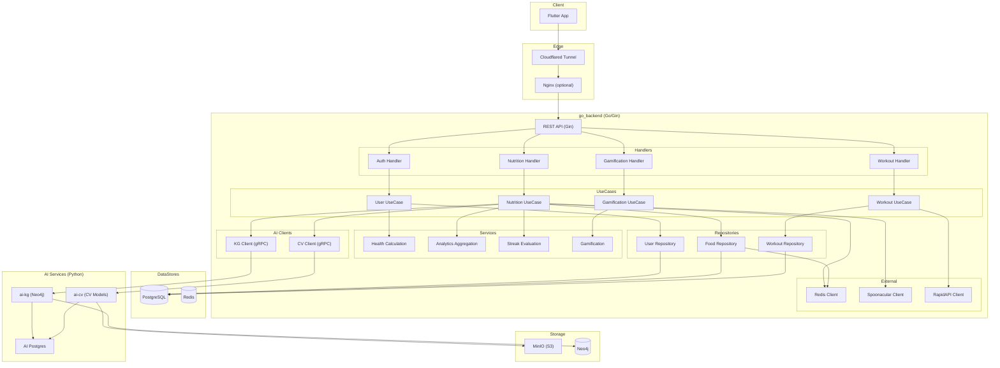

# NutriX — Architecture Documentation

> **Document Type**: Technical Architecture
> **Version**: 1.0
> **Last Updated**: 2026-08-25
> **Evidence**: `ARCHITECTURE.md`, `cmd/server/main.go`, `docker-compose.prod.yml`

---

## High-Level Architecture



---

## Component Architecture

### 1. API Gateway Layer

**Technology**: Gin Web Framework

**Responsibilities**:
- HTTP request routing
- JWT authentication middleware
- Rate limiting (Redis-backed)
- Security headers
- CORS configuration
- Prometheus metrics endpoint

**Entry Point**: `cmd/server/main.go:42-283`

### 2. Handler Layer

| Handler | File | Routes |
|---|---|---|
| UserHandler | `internal/user/delivery/http_handler.go` | `/api/v1/auth/*`, `/api/v1/users/*` |
| NutritionHandler | `internal/nutrition/delivery/http_handler.go` | `/api/v1/nutrition/*`, `/api/v1/planner/*` |
| GamificationHandler | `internal/nutrition/delivery/gamification_handler.go` | `/api/v1/gamification/*` |
| WorkoutHandler | `internal/workout/delivery/http_handler.go` | `/api/v1/workouts/*`, `/api/v1/exercises/*` |
| OFFProxyHandler | `internal/product/delivery/off_proxy_handler.go` | `/api/v1/off-proxy/*` |

### 3. UseCase Layer

| UseCase | File | Responsibilities |
|---|---|---|
| UserUseCase | `internal/user/usecase/user_usecase.go` | Auth, profile, targets |
| NutritionUseCase | `internal/nutrition/usecase/nutrition_usecase.go` | Food search, meal log, analytics, planning |
| GamificationUseCase | `internal/nutrition/usecase/gamification_usecase.go` | Achievements |
| WorkoutUseCase | `internal/workout/usecase/workout_usecase.go` | Exercise catalog, workout logging |

### 4. Service Layer

| Service | File | Responsibilities |
|---|---|---|
| HealthCalculationService | `internal/nutrition/service/health_calculation_service.go` | BMR, TDEE calculation |
| GoalStrategy | `internal/nutrition/service/goal_strategy.go` | Calorie/water targets |
| AnalyticsAggregationService | `internal/nutrition/service/analytics_aggregation_service.go` | Daily/weekly/monthly analytics |
| StreakEvaluationService | `internal/nutrition/service/streak_service.go` | Streak tracking |
| GamificationService | `internal/nutrition/service/gamification_service.go` | Achievement evaluation |

### 5. Repository Layer

| Repository | File | Database |
|---|---|---|
| PostgresUserRepository | `internal/user/repository/postgres_user.go` | PostgreSQL |
| PostgresUserPortfolioRepository | `internal/user/repository/postgres_user_portfolio.go` | PostgreSQL |
| PostgresNutritionRepository | `internal/nutrition/repository/postgres_food.go` | PostgreSQL |
| PostgresDRIRepository | `internal/nutrition/repository/postgres_dri.go` | PostgreSQL |
| PostgresStreakRepository | `internal/nutrition/repository/postgres_streak_repository.go` | PostgreSQL |
| PostgresAchievementRepository | `internal/nutrition/repository/postgres_achievement_repository.go` | PostgreSQL |
| PostgresWorkoutRepository | `internal/workout/repository/postgres_repository.go` | PostgreSQL |

---

## Data Flow

### Food Search Flow

```
┌─────────┐    GET /nutrition/foods/search?q=pho    ┌──────────────┐
│ Flutter │ ──────────────────────────────────────▶│ Gin Router   │
└─────────┘                                        └──────┬───────┘
                                                         │
                                                NutritionHandler.SearchFoods
                                                         │
                                                         ▼
┌─────────┐  SearchFoods(keyword)                   ┌──────────────┐
│ Cache   │◀────────────────────────────────────────│ NutritionUC  │
│ (Redis) │  kg:v2:food:{id}:risk:default_profile   └──────┬───────┘
└─────────┘                                                │
        │                                              FoodRepo.SearchFoods
        │  Cache HIT: return KGMetadata                       │
        │◀───────────────────────────────────────────┼────────┘
        │                                                │
        ▼                                                ▼
┌─────────────────┐                              ┌──────────────┐
│ Parse JSON      │◀─────────────────────────────│ PostgreSQL   │
│ Attach to Food  │  Foods + KGMetadata           │ (foods)     │
└────────┬────────┘                              └──────────────┘
         │
         │  Cache MISS
         ▼
┌─────────────────┐
│ kgPort.         │  gRPC BatchAnalyzeFoods
│ BatchAnalyzeFoods│────────────────────────────▶ ai-kg
└────────┬────────┘                              └──────────────┘
         │
         │  Cache result for 24h
         ▼
┌─────────┐
│ Redis   │  Set with 24h TTL
└─────────┘
```

### Meal Logging Flow

```
┌─────────┐   POST /nutrition/log-meal              ┌──────────────┐
│ Flutter │ ───────────────────────────────────▶ │ Gin Router   │
└─────────┘                                        └──────┬───────┘
                                                         │
                                                NutritionHandler.LogMeal
                                                         │
                                                         ▼
┌──────────────┐  LogMeal(userID, request)      ┌──────────────┐
│ Profile      │◀────────────────────────────────│ NutritionUC  │
│ Validation   │  allergies, medical_conditions   └──────┬───────┘
└──────────────┘                                         │
         │  Violations found                               ▼
         │◀────────────────────────────────────────┌──────────────┐
         │  422 MealBlockedError                     │ Check KG     │
         │                                            │ (local)      │
         │  No violations                             └──────┬───────┘
         │                                                    │
         ▼                                                    ▼
┌──────────────┐                                      ┌──────────────┐
│ Save MealLog │◀──────────────────────────────────────│ PostgreSQL   │
│              │  INSERT INTO food_logs                 │ (food_logs)  │
└──────┬───────┘                                      └──────────────┘
       │
       │  Trigger background hook
       ▼
┌──────────────┐
│ evaluate     │  StreakService.UpdateStreak
│ StreakHook  │──────────────────────────────────────▶ PostgreSQL
└──────┬──────┘                                        (user_streaks)
       │
       │  New streak unlocked?
       ▼
┌──────────────┐
│ Gamification │  GamificationService.CheckAchievements
│ Service      │──────────────────────────────────────▶ PostgreSQL
└──────────────┘                                        (user_achievements)
```

---

## Control Flow

### Request Lifecycle

1. **Request arrives** → Gin middleware chain
2. **CORS check** → Allowed origins validation
3. **Security headers** → X-Frame-Options, HSTS, etc.
4. **Rate limiting** → Redis token bucket (per user/IP)
5. **Auth check** → JWT validation (protected routes only)
6. **Handler execution** → Route matched to handler
7. **Response** → JSON marshaling + Prometheus metrics

### Background Processing

1. **Streak Evaluation** → Triggered after meal/water log
2. **Achievement Check** → Triggered after streak update
3. **Async Food Upsert** → Background Spoonacular result caching

---

## State Management

### Request State

- **Stateless**: Each HTTP request is independent
- **JWT in Authorization header**: Contains user ID
- **Request-scoped context**: Deadline, cancellation

### Session State

- **JWT tokens**: Short-lived (15 min access)
- **Refresh tokens**: Stored in PostgreSQL with rotation
- **No server-side session**: Horizontal scaling supported

### Application State

| State Type | Storage | Scope |
|---|---|---|
| User data | PostgreSQL | Persistent |
| Food database | PostgreSQL | Persistent |
| Meal logs | PostgreSQL | Persistent |
| Weekly plans | In-memory map | Process |
| Streaks | PostgreSQL | Persistent |
| Achievements | PostgreSQL | Persistent |
| KG cache | Redis (24h TTL) | Cross-process |
| Rate limit | Redis | Cross-process |

### Critical: Plan Cache Limitation

```
Warning: Weekly plans are cached in-memory (nutritionUseCase.planCache)
This does NOT work across multiple instances.
For horizontal scaling, migrate to Redis.
```

---

## External Integrations

### 1. Spoonacular API

| Purpose | Integration | Rate Limits |
|---|---|---|
| Food search fallback | `pkg/spoonacular/client.go` | External API limits |
| Recipe search | ComplexSearch | 150 requests/day (free tier) |
| Nutrient-based search | FindByNutrients | Included above |
| Ingredient-based search | FindByIngredients | Included above |

### 2. RapidAPI ExerciseDB

| Purpose | Integration | Rate Limits |
|---|---|---|
| Exercise catalog | `pkg/rapidapi/exercise_client.go` | External API limits |
| Exercise details | GetExerciseByID | Platform limits |

### 3. AI Services (gRPC)

| Service | Target | Port | Purpose |
|---|---|---|---|
| ai-kg | GRPC_AI_HOST | 50051 | Knowledge Graph, safety analysis |
| ai-cv | GRPC_CV_HOST | 50052 | Computer vision, food recognition |

### 4. OpenFoodFacts Proxy

| Purpose | Integration | Note |
|---|---|---|
| Product data | `internal/product/delivery/off_proxy_handler.go` | Same-origin proxy |

---

## Persistence

### PostgreSQL Tables

| Table | Purpose | Key Columns |
|---|---|---|
| users | User accounts + profiles | email, password_hash, biometrics |
| user_portfolios | Personalization JSONB | preferred_cuisines, excluded_ingredients |
| foods | Food database | name, macros, source |
| food_logs | Meal entries | user_id, food_id, calories, date |
| water_logs | Hydration tracking | user_id, amount_ml, date |
| daily_health_snapshots | Frozen daily targets | target_calories, target_water |
| user_streaks | Streak tracking | current_streak, longest_streak |
| user_achievements | Achievement unlocks | achievement_id, unlocked_at |
| dris | DRI reference data | rda, ear, ul, amdr per life stage |
| refresh_tokens | Token rotation | token_hash, family_id |
| met_activities | MET values for workouts | activity_name, met_value |
| workout_logs | Workout sessions | exercise_id, duration, calories_burned |

### Redis Keys

| Pattern | TTL | Purpose |
|---|---|---|
| `kg:v2:food:{id}:risk:{profile}` | 24h | KG metadata cache |
| `rate_limit:{key}` | 1min | Rate limiting counters |
| `session:{user_id}` | — | (not implemented) |

---

## Authentication / Authorization

### JWT Configuration

| Parameter | Value | Evidence |
|---|---|---|
| Algorithm | HS256 | `pkg/middleware/auth.go` |
| Access token expiry | 15 minutes | `config/config.go` |
| Refresh token | Rotating | `internal/user/usecase/user_usecase.go` |
| Token family | UUID-based | `RefreshToken.FamilyID` |

### Authorization Model

- **No RBAC**: Single role (user) for all authenticated users
- **Resource-level**: User ID from JWT, ownership enforced in queries
- **API-level**: Public routes (auth), Protected routes (JWT required)

### Sensitive Data Protection

- **Passwords**: bcrypt hashing
- **Refresh tokens**: SHA-256 hashed in DB
- **Allergies/Medical conditions**: AES-256 encrypted + HMAC blind index
- **GDPR readiness**: Delete user → cascade delete via FK

---

## Background Processing

### Hook-based Evaluation

```go
// Triggered after meal log (nutrition_usecase.go:288)
func (u *nutritionUseCase) evaluateStreakHook(ctx context.Context, userID uuid.UUID, date time.Time) {
    // 1. Update streak in DB
    streakSvc.UpdateStreak(ctx, userID, date)
    // 2. Check achievements
    gamificationSvc.CheckAndUnlock(ctx, userID)
}
```

### Async Operations

| Operation | Trigger | Implementation |
|---|---|---|
| Spoonacular food upsert | Search miss | `go func() { u.repo.UpsertFoods(...) }()` |
| Redis health check | Every 10s | Background goroutine |
| KG batch analysis | Food search miss | Synchronous (gRPC) |

---

## Error Handling

### Error Types

| Error | HTTP Code | Handling |
|---|---|---|
| Validation error | 400 | Return field errors |
| Unauthorized | 401 | Reject request |
| Not found | 404 | Resource-specific message |
| Conflict | 409 | Duplicate resource |
| Meal blocked | 422 | Return violations |
| All candidates rejected | 422 | Planner fallback |
| Internal error | 500 | Log + generic message |

### Resilience Patterns

| Pattern | Implementation | Evidence |
|---|---|---|
| Graceful degradation | Redis optional | `pkg/database/redis.go` |
| Circuit breaker | Redis fallback | `pkg/resilience/circuit_breaker.go` |
| Timeout handling | gRPC with context | `internal/infrastructure/grpc_nutrition_client.go` |
| Connection retry | Auto-reconnect on startup | `cmd/server/main.go` |

---

## Reliability Mechanisms

### Database

- **Connection pooling**: GORM default
- **Auto-migration**: Runs on every startup (idempotent)
- **Health checks**: Docker healthcheck for PostgreSQL

### Redis

- **Optional dependency**: Server starts if Redis unavailable
- **Fail-open rate limiting**: Falls back to in-memory limiter
- **Recovery loop**: Background goroutine checks connectivity

### AI Services

- **Graceful degradation**: Null client if gRPC fails
- **Timeout handling**: 2-10s timeouts per RPC
- **Logging**: Errors logged, request continues

### Health Checks

```
GET /ping → {"status": "ok", "message": "NutriX is healthy!"}
GET /metrics → Prometheus metrics
```

---

## Deployment Architecture

### Production Stack (docker-compose.prod.yml)

```yaml
Services:
  postgres:     # Primary database
  redis:        # Cache + rate limiting  
  minio:        # Object storage (CV images)
  ai-postgres:  # AI services DB
  neo4j:        # Knowledge graph
  ai-kg:        # Knowledge graph service (Python)
  ai-cv:        # Computer vision service (Python)
  go-seeder:    # One-time data seeding
  go-backend:   # This API
  cloudflared:  # Edge tunnel
```

### Network

- Internal Docker network: `nutrix`
- Services communicate via DNS names
- External access via Cloudflared tunnel

### Startup Dependencies

```
postgres (healthy) → redis (healthy) → go-seeder (complete) → ai-kg (healthy) → ai-cv (healthy) → go-backend (healthy)
```

---

## Configuration Architecture

### Environment Variables

| Category | Variables | Critical |
|---|---|---|
| Database | DB_DSN | 🔴 Yes |
| Redis | REDIS_URL, REDIS_PASSWORD | 🟡 No |
| Auth | JWT_SECRET, JWT_EXPIRATION_HOURS | 🔴 Yes |
| Security | ENCRYPTION_KEYS, HMAC_KEY | 🔴 Yes |
| AI | GRPC_AI_HOST, GRPC_AI_PORT | 🔴 Yes |
| External | SPOONACULAR_API_KEY, RAPIDAPI_KEY | 🟡 No |

### Critical: Panics on Missing Config

```go
// config/config.go - Required or panic
ENCRYPTION_KEYS   // AES-256 key
ACTIVE_KEY_VERSION // Key version
HMAC_KEY         // Blind index key
GRPC_AI_HOST     // AI server host
GRPC_AI_PORT     // AI server port
```

---

## Extension Points

### 1. Add New Nutrition Domain

```go
// 1. Define entity in domain/
type Supplement struct {
    ID        uuid.UUID
    Name      string
    Dosage    string
    UserID    uuid.UUID
}

// 2. Add repository interface in domain/
type SupplementRepository interface {
    Create(ctx context.Context, s *Supplement) error
    GetByUser(ctx context.Context, userID uuid.UUID) ([]Supplement, error)
}

// 3. Implement in repository/
type postgresSupplementRepository struct { db *gorm.DB }
func NewPostgresSupplementRepository(db *gorm.DB) domain.SupplementRepository

// 4. Add usecase logic
type supplementUseCase struct { repo domain.SupplementRepository }
func NewSupplementUseCase(repo domain.SupplementRepository) domain.SupplementUseCase

// 5. Add handler routes
func NewSupplementHandler(rg *gin.RouterGroup, uc domain.SupplementUseCase)
```

### 2. Add New AI Provider

```go
// 1. Define port interface in domain/
type AIModelPort interface {
    AnalyzeFood(ctx context.Context, foodID string) (*FoodAnalysis, error)
}

// 2. Implement alternative client
type openaiNutritionClient struct { /* ... */ }

// 3. Wire in main.go
aiClient := NewOpenAINutritionClient(cfg) // instead of grpcNutritionClient
```

### 3. Add New Cache Layer

```go
// Use existing Redis infrastructure
redisClient := pkgdb.NewRedisClient(cfg)

// Example: Cache user preferences
key := fmt.Sprintf("user:%s:prefs", userID)
redisClient.Set(ctx, key, data, 24*time.Hour)
```
