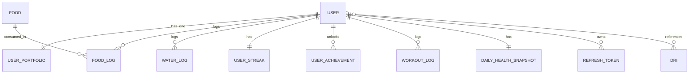

# NutriX — Data & Storage Documentation

> **Document Type**: Data Model & Storage
> **Version**: 1.0
> **Last Updated**: 2026-08-25
> **Evidence**: `internal/domain/*.go`, `pkg/database/postgres.go`, `docker-compose.prod.yml`

---

## Data Model Overview



---

## Database Schema

### PostgreSQL Tables

#### `users`

| Column | Type | Constraints | Notes |
|---|---|---|---|
| id | uuid | PK | Default gen_random_uuid() |
| username | varchar | UNIQUE, NOT NULL | |
| email | varchar | UNIQUE, NOT NULL | |
| password_hash | varchar | NOT NULL | bcrypt |
| full_name | varchar | | |
| height_cm | float8 | | |
| weight_kg | float8 | | |
| dob | date | | Nullable |
| gender | varchar | | Free text |
| activity_level | varchar | | sedentary/low_active/active/very_active |
| bmr | float8 | | Calculated |
| tdee | float8 | | Calculated |
| goal_type | varchar | | lose_weight/maintain/gain_weight |
| timezone | varchar | | Default 'UTC' |
| weekly_calorie_budget | float8 | | |
| dietary_preference | varchar | | vegan/vegetarian/halal |
| allergies | text | | Comma-separated |
| allergies_bidx | varchar | INDEX | HMAC blind index |
| medical_conditions | text | | Comma-separated disease IDs |
| medical_conditions_bidx | varchar | INDEX | HMAC blind index |
| created_at | timestamp | | |
| updated_at | timestamp | | |

#### `user_portfolios`

| Column | Type | Constraints | Notes |
|---|---|---|---|
| user_id | uuid | PK, FK | ON DELETE CASCADE |
| preferred_cuisines | jsonb | | Array of strings |
| disliked_ingredients | jsonb | | Array of strings |
| excluded_ingredients | jsonb | | Array of strings |
| meal_schedule | jsonb | | Object with meal times |
| daily_water_target_ml | int | | Override |
| calorie_target_override | float8 | | Override |
| macro_split_override | jsonb | | Object |
| notes | text | | |
| created_at | timestamp | | |
| updated_at | timestamp | | |

#### `foods`

| Column | Type | Constraints | Notes |
|---|---|---|---|
| id | uuid | PK | Default gen_random_uuid() |
| spoonacular_id | int | UNIQUE | Nullable |
| code | varchar | UNIQUE | e.g., VFA-xxx, USDA-xxx |
| name | varchar | | Primary name |
| name_vi | varchar | | Vietnamese name |
| name_en | varchar | | English name |
| category | varchar | | |
| source | varchar | DEFAULT 'VFA' | VFA/VFA_DISH/USDA/Spoonacular/custom |
| calories_per_100g | float8 | | Primary macro |
| protein_per_100g | float8 | | Primary macro |
| carbs_per_100g | float8 | | Primary macro |
| fat_per_100g | float8 | | Primary macro |
| serving_size | varchar | | e.g., "650g", "100g" |
| is_portion_normalized | bool | DEFAULT true | |
| micronutrients | jsonb | DEFAULT '{}' | All other nutrients |
| is_vegan | bool | | |
| is_vegetarian | bool | | |
| is_gluten_free | bool | | |
| is_dairy_free | bool | | |
| image_url | varchar | | |
| is_verified | bool | DEFAULT true | |
| creator_id | uuid | FK (users) | Nullable |

#### `food_logs`

| Column | Type | Constraints | Notes |
|---|---|---|---|
| id | uuid | PK | Default gen_random_uuid() |
| user_id | uuid | FK, INDEX | ON DELETE CASCADE |
| food_id | uuid | FK, INDEX | |
| consumed_date | date | NOT NULL | |
| meal_type | varchar | | breakfast/lunch/dinner/snack |
| quantity_grams | float8 | NOT NULL | |
| calories_consumed | float8 | NOT NULL | Calculated |
| protein_consumed | float8 | NOT NULL | Calculated |
| fat_consumed | float8 | NOT NULL | Calculated |
| carbs_consumed | float8 | NOT NULL | Calculated |
| logged_at | timestamp | autoCreateTime | |

#### `water_logs`

| Column | Type | Constraints | Notes |
|---|---|---|---|
| id | uuid | PK | |
| user_id | uuid | FK, INDEX | ON DELETE CASCADE |
| amount_ml | int | NOT NULL | |
| logged_at | timestamp | autoCreateTime | |

#### `daily_health_snapshots`

| Column | Type | Constraints | Notes |
|---|---|---|---|
| id | uuid | PK | |
| user_id | uuid | FK, INDEX | ON DELETE CASCADE |
| snapshot_date | date | NOT NULL | UNIQUE (user_id, snapshot_date) |
| weight_kg | float8 | | |
| activity_level | varchar | | |
| goal_type | varchar | | |
| bmr | int | | |
| tdee | int | | |
| target_calories | int | | Frozen target |
| target_water | int | | Frozen target |
| goal_strategy_version | varchar | | |
| created_at | timestamp | | |
| updated_at | timestamp | | |

#### `user_streaks`

| Column | Type | Constraints | Notes |
|---|---|---|---|
| user_id | uuid | PK | |
| current_streak | int | NOT NULL | |
| longest_streak | int | NOT NULL | |
| last_evaluated_date | date | NOT NULL | |
| created_at | timestamp | | |
| updated_at | timestamp | | |

#### `user_achievements`

| Column | Type | Constraints | Notes |
|---|---|---|---|
| user_id | uuid | PK, PART | |
| achievement_id | varchar | PK | |
| unlocked_at | timestamp | autoCreateTime | |

#### `dris`

| Column | Type | Constraints | Notes |
|---|---|---|---|
| id | uuid | PK | |
| life_stage_group | varchar | | e.g., "19-30 Male" |
| nutrient_name | varchar | | |
| rda_ai | jsonb | | Recommended Dietary Allowance |
| ear | jsonb | | Estimated Average Requirement |
| ul | jsonb | | Tolerable Upper Intake Level |
| amdr | jsonb | | Acceptable Macronutrient Distribution |

#### `refresh_tokens`

| Column | Type | Constraints | Notes |
|---|---|---|---|
| id | uuid | PK | |
| user_id | uuid | FK, INDEX | ON DELETE CASCADE |
| token_hash | varchar | UNIQUE, NOT NULL | SHA-256 |
| family_id | uuid | INDEX, NOT NULL | Token family for rotation |
| expires_at | timestamp | NOT NULL | |
| revoked | bool | DEFAULT false | |
| created_at | timestamp | autoCreateTime | |

#### `met_activities`

| Column | Type | Constraints | Notes |
|---|---|---|---|
| id | varchar | PK | |
| activity_name | varchar | UNIQUE, NOT NULL | |
| met_value | float8 | NOT NULL | Metabolic Equivalent |
| category | varchar | | |

#### `workout_logs`

| Column | Type | Constraints | Notes |
|---|---|---|---|
| id | uint | PK | AutoIncrement |
| user_id | uuid | FK, INDEX | |
| exercise_id | varchar | NOT NULL | No FK |
| exercise_name | varchar | NOT NULL | |
| duration_minutes | int | NOT NULL | |
| calories_burned | float8 | NOT NULL | |
| logged_at | timestamp | autoCreateTime | |

---

## Micronutrients Schema

The `micronutrients` column in `foods` table stores unstructured nutrient data:

```json
{
  "Sodium": "120.000000 mg",
  "Potassium": "200.000000 mg",
  "Phosphorus": "150.000000 mg",
  "Calcium": "50.000000 mg",
  "Iron": "2.500000 mg",
  "Vitamin A": "100.000000 mcg",
  "Vitamin C": "5.000000 mg"
}
```

**Note**: Only 4 primary macros have dedicated columns:
- `calories_per_100g`
- `protein_per_100g`
- `carbs_per_100g`
- `fat_per_100g`

All other nutrients are stored as key-value strings in `micronutrients` JSONB.

---

## Input Formats

### Registration Request

```json
{
  "username": "john_doe",
  "email": "john@example.com",
  "password": "SecurePass123",
  "full_name": "John Doe",
  "height_cm": 175.0,
  "weight_kg": 70.0,
  "dob": "1990-05-15",
  "gender": "male",
  "activity_level": "active",
  "dietary_preference": "none",
  "medical_conditions": "diabetes_type2,gout"
}
```

### Log Meal Request

```json
{
  "food_id": "uuid-here",
  "quantity_grams": 150.0,
  "meal_type": "lunch",
  "consumed_date": "2026-08-25",
  "reference_weight_g": 100.0,
  "acknowledged_risk": false
}
```

### Log Water Request

```json
{
  "amount_ml": 250,
  "logged_at": "2026-08-25T10:30:00Z"
}
```

---

## Output Formats

### Daily Plan Response

```json
{
  "target_calories": 2000,
  "consumed_calories": 850,
  "burned_calories": 150,
  "target_water": 2000,
  "consumed_water": 750,
  "logged_meals": [
    {
      "id": "uuid",
      "food_id": "uuid",
      "meal_type": "breakfast",
      "quantity_grams": 200,
      "calories_consumed": 400,
      "protein_consumed": 20,
      "fat_consumed": 15,
      "carbs_consumed": 50,
      "consumed_date": "2026-08-25T00:00:00Z"
    }
  ],
  "recommended_foods": []
}
```

### Weekly Analytics Response

```json
{
  "type": "rolling",
  "window_days": 7,
  "start_date": "2026-08-19",
  "end_date": "2026-08-25",
  "days": [
    {
      "date": "2026-08-25",
      "consumed_calories": 850,
      "target_calories": 2000,
      "consumed_water": 750,
      "target_water": 2000,
      "estimated_daily_burn": 1850,
      "workout_burned": 150,
      "total_burned": 2000,
      "calorie_goal_hit": false,
      "water_goal_hit": false,
      "goal_hit": false
    }
  ],
  "weekly_consumed_calories": 4500,
  "weekly_burned_calories": 750,
  "weekly_consumed_water": 10500,
  "streak_days": 5
}
```

---

## Data Transformations

### Food Search → Response

```
Input: "pho"
  ↓
Postgres FULLTEXT search (pg_trgm)
  ↓
Batch KG enrichment (if cache miss)
  ↓
Attach KGMetadata to each food
  ↓
Return foods with safety signals
```

### Meal Logging → Storage

```
Input: LogMealRequest
  ↓
Resolve Food by ID
  ↓
Calculate ratio: quantity_grams / reference_weight_g
  ↓
Scale macros: calories_per_100g * ratio
  ↓
Create MealLog with calculated values
  ↓
INSERT INTO food_logs
```

### Analytics → Aggregations

```
Raw: food_logs (per-meal records)
  ↓
GROUP BY consumed_date, SUM(calories_consumed)
  ↓
Merge with water_logs
  ↓
Merge with workout_logs
  ↓
Compare with daily_health_snapshots (frozen targets)
  ↓
Return DayAnalytics[]
```

---

## Validation Rules

| Field | Rule | Evidence |
|---|---|---|
| food_id | Required UUID | `binding:"required"` |
| quantity_grams | > 0, <= 5000 | `binding:"gt=0,lte=5000"` |
| meal_type | Required string | `binding:"required"` |
| consumed_date | YYYY-MM-DD format | Handler parses with `time.Parse` |
| email | Valid email format | `binding:"required,email"` |
| password | min 6 chars | `binding:"required,min=6"` |
| username | Required string | `binding:"required"` |

---

## Serialization

- **API Format**: JSON
- **Database**: PostgreSQL with GORM
- **Cache**: Redis (JSON strings)
- **gRPC**: Protocol Buffers

---

## Caching Strategy

| Data | Cache Key Pattern | TTL | Strategy |
|---|---|---|---|
| KG metadata | `kg:v2:food:{foodID}:risk:{profileHash}` | 24h | Write-through |
| Rate limit | `rate_limit:{ip}:{minute}` | 1min | LRU |

### Cache Flow for Food Search

```go
// nutrition_usecase.go:116-158
for _, f := range rawResults {
    foodID := f.ID.String()
    cacheKey := fmt.Sprintf("kg:v2:food:%s:risk:%s", foodID, profileHash)
    
    // Try cache first
    cached, err := u.redis.Get(ctx, cacheKey).Result()
    if err == nil && cached != "" {
        // Cache HIT → unmarshal and attach
        var meta domain.KGMetadata
        json.Unmarshal([]byte(cached), &meta)
        enrichedMap[foodID] = domain.BatchFoodMetadata{KGMetadata: &meta}
        continue
    }
    
    // Cache MISS → call AI, cache result
    missingFoodIDs = append(missingFoodIDs, foodID)
}

// On miss: call gRPC → cache for 24h
u.redis.Set(ctx, cacheKey, string(jsonData), 24*time.Hour)
```

---

## Data Lineage

### User Profile

```
Registration Form
    ↓
User entity created
    ↓
Password hashed (bcrypt)
    ↓
BMR/TDEE calculated (if biometrics provided)
    ↓
Stored in users table
```

### Meal Log

```
Client input (food_id, quantity, meal_type)
    ↓
Food resolved from foods table
    ↓
Macros scaled by quantity ratio
    ↓
Validated against user profile (allergies)
    ↓
Stored in food_logs
    ↓
Daily snapshot updated
    ↓
Analytics aggregated
```

---

## Retention Behavior

| Data | Retention | Evidence |
|---|---|---|
| User account | Until deleted | No automatic cleanup |
| Meal logs | Indefinite | No cleanup mechanism |
| Water logs | Indefinite | No cleanup mechanism |
| Daily snapshots | Indefinite | No cleanup mechanism |
| Streaks | Indefinite | No cleanup |
| Achievements | Permanent | No revocation |
| Refresh tokens | Until revoked/expired | 72h default expiry |

---

## Data Consistency Mechanisms

### Transaction Support

```go
// domain/NutritionRepository interface
type NutritionRepository interface {
    // ...
    WithTransaction(ctx context.Context, fn func(repo NutritionRepository) error) error
    // ...
}
```

### Profile Update → Target Recalculation

```go
// user_usecase.go:UpdateProfile
// 1. Update user record
// 2. Recalculate BMR using HealthCalculationService
// 3. Recalculate TDEE using HealthCalculationService
// 4. Update in same transaction (if WithTransaction used)
```

### Streak Atomic Updates

```go
// streak_service.go
// Uses GORM transactions to update streak atomically
func (s *streakEvaluationService) UpdateStreak(...) {
    // 1. Get current streak
    // 2. Calculate new streak based on snapshots
    // 3. Upsert in single transaction
}
```

---

## Filesystem Storage

### Image Uploads

| Path | Purpose | Evidence |
|---|---|---|
| `./uploads/foods/` | User-uploaded food images | `internal/nutrition/delivery/http_handler.go:290` |

```go
// Upload handler saves to filesystem
uploadDir := "uploads/foods"
savePath := filepath.Join(uploadDir, filename)
c.SaveUploadedFile(file, savePath)
```

### MinIO (S3-compatible)

| Bucket | Purpose | Evidence |
|---|---|---|
| (configured in docker-compose) | CV image storage | `docker-compose.prod.yml:47-59` |

**Note**: MinIO is configured but may not be fully integrated with the upload handler.

---

## Data Export/Import

### Seed Data Files

| File | Purpose | Records |
|---|---|---|
| `vfa_food_db.json` | Vietnamese ingredients | ~200 items |
| `vfa_dishes_db.json` | Vietnamese dishes | ~30 items |
| `usda_core_foods.json` | USDA foods | ~100 items |
| `DRIs.json` | Dietary Reference Intakes | Multiple life stages |
| `met_activities.json` | MET exercise values | ~50 activities |

### Migration System

```go
// pkg/database/postgres.go:48-173
func RunMigrations(db *gorm.DB) error {
    // 1. Enable extensions
    db.Exec("CREATE EXTENSION IF NOT EXISTS pg_trgm")
    db.Exec("CREATE EXTENSION IF NOT EXISTS unaccent")
    
    // 2. AutoMigrate GORM models
    db.AutoMigrate(&domain.User{}, &domain.Food{}, ...)
    
    // 3. Run explicit SQL migrations
    // migrations/001_add_timezone_to_users.sql
    // migrations/002_create_daily_health_snapshots.sql
    // migrations/003_create_user_streaks.sql
    // migrations/004_create_user_achievements.sql
    // migrations/005_normalize_pho_thin_nutrition.sql
    // migrations/006_add_is_portion_normalized.sql
}
```
